https://mermaid-js.github.io/mermaid/#/flowchart

### A node(default)

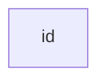

### A node with text

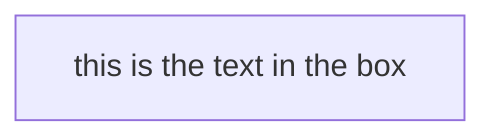

## Graph

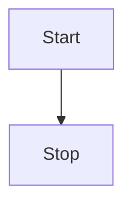

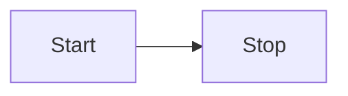

## Node shapes

### A node with round edges

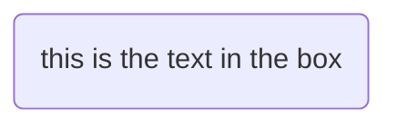

### A stadium-shaped node

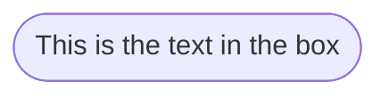

### A node in a subroutine shape

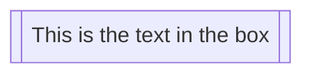

### A node in a cylindrical shape

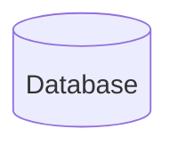

### A node in the form of a circle

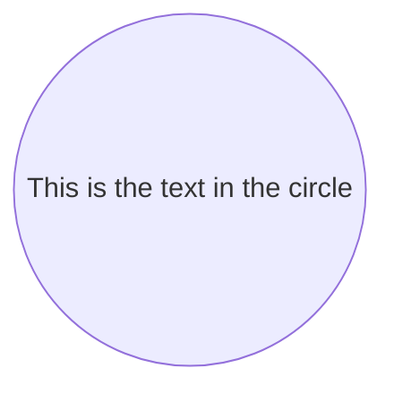

### A node in an asymmetric shape

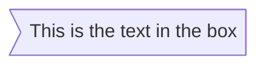

### A node(rhombus)

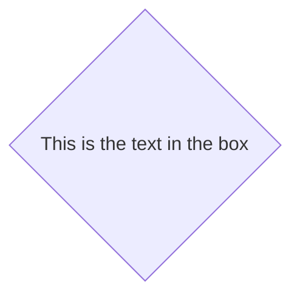

### A hexagon node

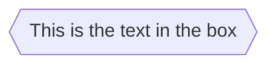

### Parallelogram

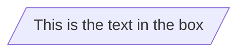

### Parallelogram alt

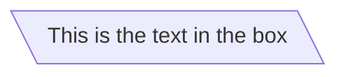

### Trapezoid

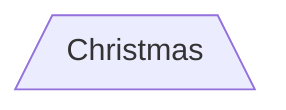

### Trapezoid alt

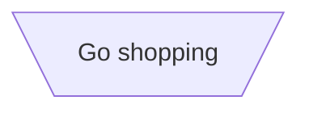

### Double circle

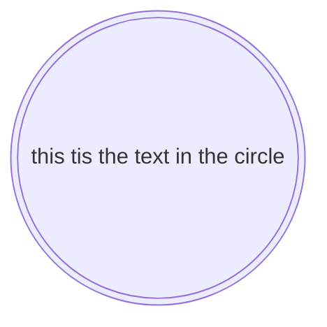

## Links between nodes

### A link with arrow head

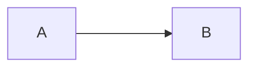

### An open link

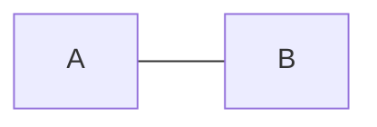

### An invisible link

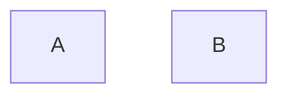

### Text on links

```mermaid
flowchart LR
    A-- this is the text! ---B
```

or

```mermaid
flowchart LR
    A---|this is the text|B
```

### A link with arrow thead and text

```mermaid
flowchart LR
    A-->|text|B
```